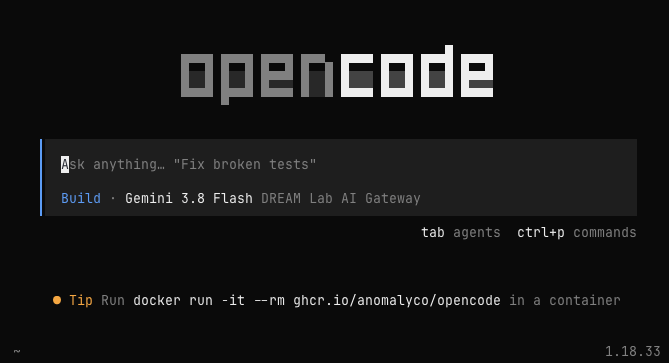
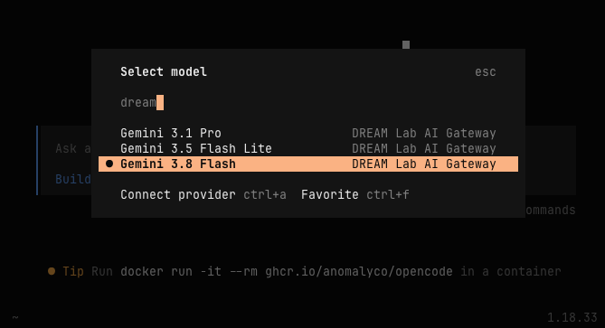

Coder workspaces provide a relatively safe way to experiment with AI coding
agents, like OpenCode, Pi, Claude Code, or OpenAI's Codex. These tools, which
generate and also *execute* code, are very useful, but they come with
[significant risks](https://simonwillison.net/tags/prompt-injection/). Because
Coder workspaces are isolated virtual machines, the potential damage a rogue AI
agent running in a workspace can cause is reduced (but not eliminated).

## OpenCode

[OpenCode](https://opencode.ai) is an open source coding agent that works with a
wide range of AI services and model providers. It is preinstalled on Coder
Workspaces. Refer to [OpenCode's documentation](https://opencode.ai/v2/docs) for
a comprehensive overview of its features. 

To start OpenCode, run `opencode` from the command line in a workspace.



By default, OpenCode uses models from its own model services ("Zen" or OpenCode
Go). We don't recommend using them due to data privacy concerns. Instead, we
recommend using models through the [DREAM Lab AI Gateway](ai-gateway.qmd) or
[College IT's AI Gateway](https://docs.cloud.college.ucsb.edu/AI-LLM). 

:::{.callout-tip}

Use the `/models` command in OpenCode to select a model from your preferred
model provider.

:::

### College IT (CIT) AI Gateway

[CIT's AI gateway](https://docs.cloud.college.ucsb.edu/AI-LLM) provides
on-premises large language model access for UCSB staff and faculty; incidental
student use is supported. All inference runs on CIT-owned hardware, and your
prompts stay on campus unless you enable tools such as web search that call
external services.

To use CIT models, use OpenCode's `/models` command, then filter the model list
using "CIT."

### DREAM Lab AI Gateway

[DREAM Lab's AI Gateway](ai-gateway.qmd) provides limited access to cloud-hosted
LLMs through an OpenAI-compatible endpoint. OpenCode is preconfigured with
access to the gateway, but an API key is required to use it. Use the gateway's
[API Key manager](https://litellm.dreamlab.ucsb.edu/dreamlab-keys) to generate a
new key (requires login with your UCSB NetID).

There are a few different ways to configure OpenCode to use the API Key:

- Set the **DREAM Lab LLM API Key** option when you create your workspace, or
  set it in the workspace settings/parameters (you will need to restart the
  workspace).
- Set it manually using the `DREAMLAB_LLM_KEY` environment variable, before starting OpenCode:

```sh
# set your api key and start opencode.
export DREAMLAB_LLM_KEY=sk-....
opencode
```

To use models through the DREAM Lab AI gateway, use OpenCode's `/models` command
and then filter the model list using "DREAM Lab".


