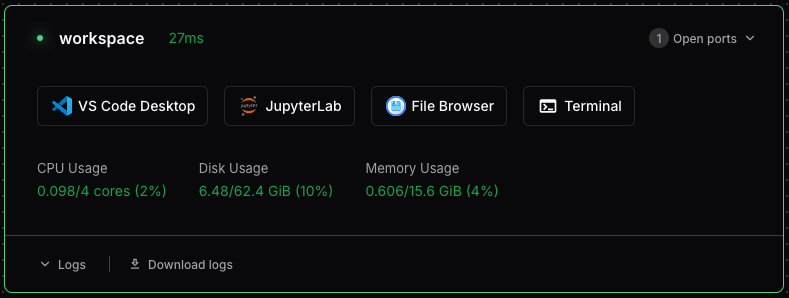
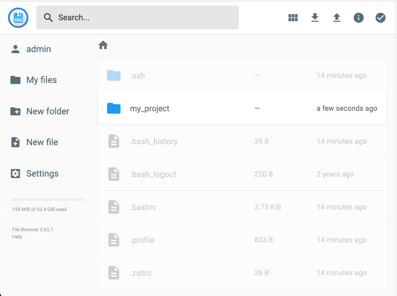

There are several ways to upload and download files to a Coder Workspace.
Coder's built-in [File Browser](#coder-file-browser) is the most
straightforward. [Magic Wormhole](#magic-wormhole) is well suited for moving
files between Workspaces. [Rclone](#rclone-connecting-to-google-drive) is a
more sophisticated option that supports advanced features like connecting to
Google Drive.

## Coder File Browser

The most convenient way to transfer files to/from a Coder Workspace is to use
the built-in File Browser, which you can access from Workspace's dashboard.



Clicking the File Browser button from Workspace dashboard opens the File Browser
in a new browser window. (You may need to enable popups in your browser
settings). 

{width=70%}

## Magic Wormhole

[Magic Wormhole](https://github.com/magic-wormhole/magic-wormhole) 
is a command line utility that makes it easy to send files
and directories directly between two machines using a short, one-time
code. No accounts, servers, or SSH configuration required — just run a
command on each side and the transfer happens over an end-to-end
encrypted channel.

You can use Magic Wormhole without installing it by running it with
[`uvx`](https://docs.astral.sh/uv/guides/tools/), which executes Python
tools in temporary environments. `uvx` is part of `uv` and is installed on all
Coder Workspaces by default

**Sending a file or directory:**

```bash
uvx magic-wormhole send ./myfile.txt
# or for a directory
uvx magic-wormhole send ./my-project
```

Magic Wormhole will print a short code like `7-guitarist-revenge`. Use the code
to download the files on the destination:

**Receiving a file or directory:**

```bash
uvx magic-wormhole receive 7-guitarist-revenge
```

The code is single-use and expires once the transfer completes or is
cancelled.

This is a great way to migrate files and entire project directories
between Coder workspaces!

## Rclone: Connecting to Google Drive

[Rclone](https://rclone.org/) is a powerful file transfer tool that is installed
on all Coder Workspaces by default. You can use it to connect to your Google
Drive.

::: {.callout-note}

These instructions require connecting to your Workspace using the VS Code
Desktop application. This is required only for giving Rclone permissions to
access Google Drive. Once you've completed that step, you don't need to use VS
Code.

:::

Rclone can map a folder in your Workspace (e.g., `~/gdrive`) to your Google
Drive. To avoid deleting anything in your Drive, use read-only permissions (as
shown).

1. Connect to your Workspace using VS Code. Click the VS Code Desktop icon from
the Workspace dashboard.

1. In VS Code, open a Terminal window: View → Terminal (or Ctrl + \`). The rest
    of these instructions are shell commands you'll enter in the Terminal.
    
2. Install Rclone (if necessary)

    Rclone should be installed on your workspace by default. If it isn't, you can use this command to instal it"

    `sudo apt update && sudo apt install rclone`

3. Give Rclone read-only access to your Google Drive. (For full read and write
permissions, remove `scopes drive.readonly`. See Rclone's [complete
documentation](https://rclone.org/drive/#scopes) for Google Drive scopes).

    `rclone config create gdrive drive scopes drive.readonly`

1. A web browser should open. In the browser, grant Rclone permission to access
your Google Drive. (This access is limited to the Workspace itself). Once
completed, you should see a message: "Success! All done. Please go back to rclone."
Close the browser window and go back to the VS Code Terminal window.

1. Create a folder to map to your Google Drive
    
    `mkdir ~/gdrive`

2. "mount" your Google Drive to the folder

    `rclone mount gdrive: ~/gdrive --daemon`

3. Confirm that you can list files in your Drive using the folder.
    
    `ls ~/gdrive`

You can now access files in your Google Drive using the `~/gdrive` folder. To
disconnect the folder from your Drive, use the command: `umount ~/gdrive` 

If `umount` doesn't work, it's often because you have a file open or your
terminal is running in a subdirectory of `~/gdrive`.

