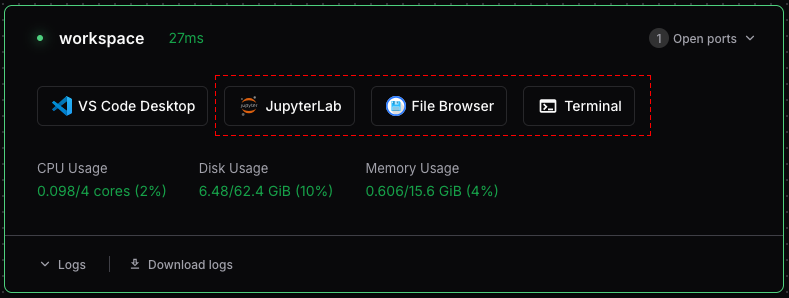

Welcome to Coder! This guide will help you create your first workspace and connect to it using various tools.

## Creating a Workspace

1. Visit <https://coder.dreamlab.ucsb.edu>.
2. Click "UCSB Login" and log in using UCSB SSO (via Google).
3. Click the button to create a Dreamlab Workspace.
4. On the "Create Workspace" page:
    *  Give the workspace a name.
    *  Check "I understand the usage policies".
    *  Select additional software to enable.
    *  Click "Create Workspace".
    *  It may take a few minutes for the workspace to boot.


## Connecting to Your Workspace

Once your workspace is created, you should be directed to the workspace dashboard. There are two main ways to interact with your new workspace: directly through the browser or by using software locally installed on your machine.



Browser-based tools include:

- **JupyterLab**, or **RStudio**: These are optional IDEs for data analyis using R or Python.
- **File Browser**: for navigating your workspace's file system and transfering files.
- **Terminal:** a browser-based terminal that provides instant access to your workspace's shell environment.

To use these, simply click the corresponding icon on your workspace's dashboard page.

### Connecting with Locally Installed Software

For a more integrated development experience, you can connect your local tools to your Coder workspace. This typically requires installing the Coder CLI and the appropriate extensions for your IDE.

#### Connecting via VS Code

You can develop in your Coder workspace remotely using the Visual Studio Code desktop client.

1. Ensure you have the [Visual Studio Code](https://code.visualstudio.com/) desktop application installed.
2. Install the **Coder** extension from the VS Code Marketplace.
3. Once the extension is installed, open the Command Palette (`Ctrl+Shift+P` or `Cmd+Shift+P` on macOS) and type `Coder: Login`.
4. Enter your Coder deployment URL: `https://coder.dreamlab.ucsb.edu` .
5. After logging in, you can browse your workspaces in the Coder view on the sidebar, or use the Command Palette (`Coder: Open Workspace`) to connect to your workspace and start coding.

#### Connecting via Coder CLI

The Coder CLI can be used to authenticate and connect to your workspaces from the command line.

**Installing the Coder CLI:**

On Linux/macOS, the fastest way to install the CLI is using the install script:

```sh
curl -L https://coder.com/install.sh | sh
```

For Windows, download and run the installer program ([coder_2.30.6_windows_amd64_installer.exe ](https://github.com/coder/coder/releases/download/v2.30.6/coder_2.30.6_windows_amd64_installer.exe)) 
from [Coder's GitHub Releases page](https://github.com/coder/coder/releases). 
You may want to refer to the [Coder CLI documentation](https://coder.com/docs/install/cli).

**Authenticate the CLI:**

Once installed, log in to your Coder deployment using your terminal:

```sh
coder login https://coder.dreamlab.ucsb.edu
```
Follow the prompts to complete authentication via your web browser.

**Connecting via SSH:**

You can connect directly to your workspace using the Coder CLI:

```sh
coder ssh <workspace-name>
```
