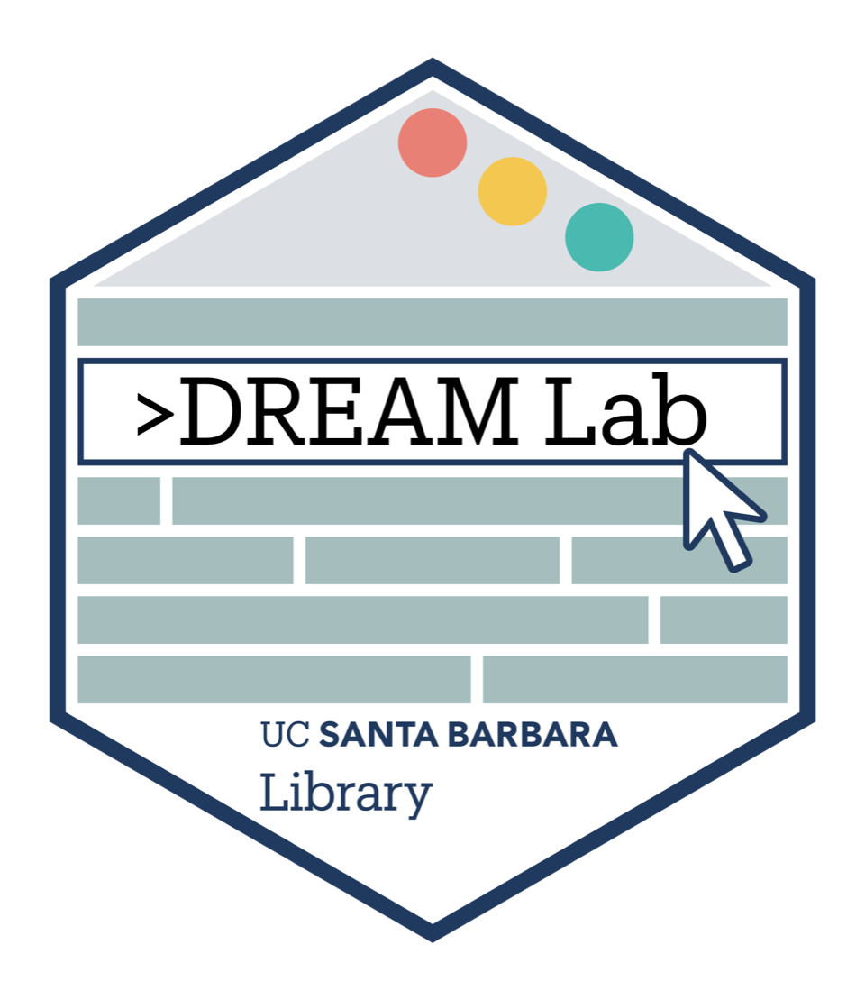

::: {.hero}

{.hero-logo fig-alt="DREAM Lab hex logo — UC Santa Barbara Library"}

# DREAM Lab Service Portal {.hero-title}

Cloud computing services for research and teaching at UC Santa Barbara. The
services here are managed by the
[UCSB Library DREAM Lab](https://www.library.ucsb.edu/dreamlab) and use
computing resources provided by the
[College of Letters and Science IT](https://www.lsit.ucsb.edu).

:::

::: {.grid .quick-links}

::: {.g-col-12 .g-col-md-4}
<a class="link-card" href="https://coder.dreamlab.ucsb.edu" target="_blank" rel="noopener">
<i class="bi bi-box-arrow-up-right" aria-hidden="true"></i>
Launch a Coder Workspace (opens in a new tab)
Log in with your UCSB NetID at coder.dreamlab.ucsb.edu
</a>
:::

::: {.g-col-12 .g-col-md-4}
<a class="link-card" href="coder.qmd">
<i class="bi bi-book" aria-hidden="true"></i>
Coder Workspace Documentation
Hardware, software, policies, and how-to guides
</a>
:::

::: {.g-col-12 .g-col-md-4}
<a class="link-card" href="https://www.library.ucsb.edu/dreamlab" target="_blank" rel="noopener">
<i class="bi bi-info-circle" aria-hidden="true"></i>
About the DREAM Lab (opens in a new tab)
Workshops, consultations, and the lab's other services
</a>
:::

:::

::: {.portal-help}

## Getting Help {.portal-help-title}

Email <dreamlab@library.ucsb.edu> or join the
[UCSB Carpentry Slack](https://join.slack.com/t/ucsbcarpentry/shared_invite/zt-3chxqtb2b-cVc3l~yj1ghUhZLNmOLfhQ).

:::
